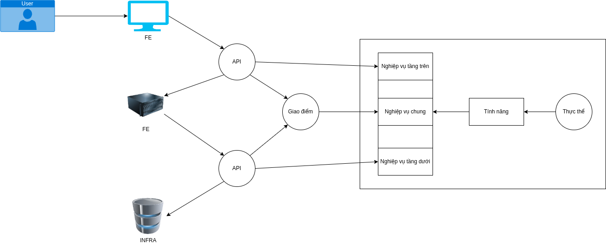

# Cấu trúc chính trong dự án:



# Nghiệp vụ

## Thực thể

- User: Có thể đăng bài, chỉnh sửa, xóa bài viết của bản thân, follow user khác
- Post: Chèn emoji, lấy link, bình luận
- Tag (Giới hạn số lượng)
- Comment: Link, Trang trí chữ, hình ảnh (dưới dạng link), gg live view
- Report (Giới hạn số lần report trong 1 đơn vị thời gian)
- Role
  - Ban / Mute
  - Custom
  - Admin / Moderator

## Tính năng

### FE

- Tự động dịch bình luận, bài viết
- Thêm live view của google map
- Tự động lấy role / gán role
- Báo cáo bình luận
- Chặn thành viên khác

### BE

- Lấy thông tin người dùng
- Lấy thông tin bài viết
- Lấy thông tin bình luận

### INFRA

- Tự động xếp user vào nhóm 'mute' khi chưa hết timeout
- Áp dụng xóa mềm, sau một khoảng thời gian thì sẽ có cơ chế dọn rác

## Nghiệp vụ

- Admin ủy quyền moderator
- Ban / Mute

# API route (FE - BE)

```text
/user/:id #Danh sách người dùng
/post/:id #Danh sách post
/post/tag? #Truy vấn theo tag
/post/comment/:id #Danh sách các comment trong 1 post
/post/comment/report/:id #Cho admin với moderator xem
```

# Chức năng chính trong page

## Home

- Thanh tìm kiếm -> truy cập vào trang post/ sau đó thì thực hiện truy vấn theo api route

- Thông báo quan trọng (admin)

- Bài đăng nổi bật

- Bạn đang quan tâm

- Bài đăng mới

- Danh sách các bài đăng

## About

- Giới thiệu thành viên, mục đích xây dựng

- Yêu thầy Shin, cô Linh.

## Profile

- Yêu thích

- Đã lưu

- Thông tin cá nhân

## Post

- Chức năng live-view google map khi bình luận

- Gợi ý ngữ pháp

- Thả emoji, lưu link bài viết

# Hạ tầng cơ sở

- Sử dụng hạ tầng của Nhân (Trong giai đoạn phát triển)

- Sử dụng scheduler khi áp dụng xóa mềm, tự động cập nhật trạng thái khi mute
